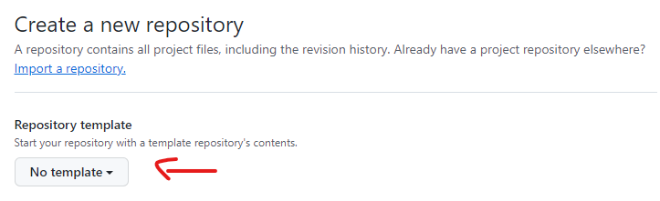

# my_library: Template Python repository

This repository serves as a template for creating a Python library

## How do I use this?

1. Create a new repository in GitHub with this repo as a starting point
    

2. Change all occurences of `my_library` to match the name of your new library

3. Consider if the [license](LICENSE) should be modified.

## Additional resources

If you're interested in learning more about best practices for developing Python packages, check out the following resources:

- [Python Package Development at DHI](https://dhi.github.io/python-package-development/)
- [Scientific Python Library Development Guide](https://learn.scientific-python.org/development/)
